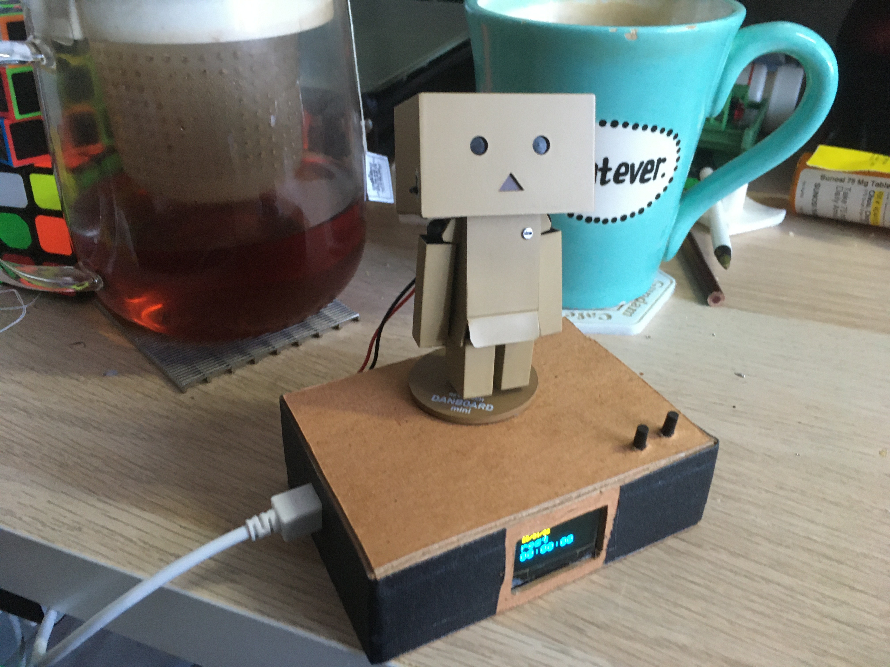

## Living With Dumbo
Living With Dumbo is a project for "living with robot" which is a class at Integrated Digital Media, Tandon, NYU, taught by professor Kathleen McDermott.

[blog](https://sidchoublog.wordpress.com/2020/04/29/living-with-dumbo/)

[demo video](https://vimeo.com/412897472)

